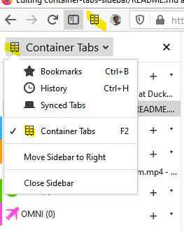

# Container Tabs Sidebar

A firefox addon that shows currently opened tabs in a sidebar grouped by a privacy container.


## How to use

In order to use this addon it's recommended to have firefox version >=59 installed. It might work with a version as low as 54, but there were no tests done with these builds. You can download the latest firefox from [firefox.com](https://www.mozilla.org/en-US/firefox/new/)

### Installing from [addons.mozilla.org](https://addons.mozilla.org/en-US/firefox/addon/container-tabs-sidebar/?src=github)

1. Visit [Container Tabs Sidebar on mozilla.org](https://addons.mozilla.org/en-US/firefox/addon/container-tabs-sidebar/?src=github)
2. Click Add to Firefox button

### Manually installing the addon for development purposes

#### Debugging via npm:
1. If you have `npm` installed, you can execute the following command: `npm run dev`. A Firefox window should open.

#### Installing as temporary add-on
1. Clone or download a zip of this repository.
3. Navigate to `about:debugging`.
4. Click _Load Temporary Add-on_.
5. Select manifest.json inside `src` directory.

### Opening the sidebar

In order to open the sidebar click __F2__ button on your keyboard. If it doesn't work then open any sidebar (eg. using __Ctrl+b__), and change the sidebar via dropdown menu.

### Customizing containers

In order to add/remove containers navigate to `about:preferences#containers`.

## Appearance modifications

Summary of  [How to Create a userChrome.css File on userchrome.org](https://www.userchrome.org/how-create-userchrome-css.html)
1. Create a file called 'userChrome.css' in a directory called 'chrome' inside your user profile directory
1. Add the below data to the file

**Warning:** Starting with Firefox 69 you have to enable *toolkit.legacyUserProfileCustomizations.stylesheets* in *about:config* in order to use modifications listed below.

**Note:** For Firefox <72 you also need a `@namespace` directive at the beginning of the file. 

**Note:** the `@namespace` directive only has to appear once in that file.

```css
@namespace url("http://www.mozilla.org/keymaster/gatekeeper/there.is.only.xul");
```

See [this discussion thread](https://bugzilla.mozilla.org/show_bug.cgi?id=1605208) for details.

### Hiding the Sidebar Header

In order to hide the sidebar header you need to append to the `userChrome.css` file the following code:

```css
#sidebar-box[sidebarcommand^="containertabs"] #sidebar-header {
	display: none;
}
```

|Before|After|
|----|---|
| | 

### Hiding the Tab Bar

In order to hide the Tab Bar you need to append to the `userChrome.css` the following code:

```css
@namespace url("http://www.mozilla.org/keymaster/gatekeeper/there.is.only.xul");

#main-window:not([tabsintitlebar="true"]) #TabsToolbar {
    visibility: collapse !important;
}
```


```css
/* for Firefox 72 and beyond */
/* credit to stapuft at https://github.com/piroor/treestyletab/issues/2207#issuecomment-478288590 */

#tabbrowser-tabs {
  visibility: collapse !important;
}
```


### Change Icon into Black from White
This userChrome.css rule will make the icon become black on Toolbar, Sidebar, and Pop up menu


```css
#sidebar-box[sidebarcommand^="containertabs"] #sidebar-header #sidebar-icon,
#sidebarMenu-popup #button_containertabssidebar_maciekmm_net-sidebar-action .toolbarbutton-icon,
#nav-bar-customization-target #containertabssidebar_maciekmm_net-browser-action .toolbarbutton-icon {
  filter: invert(100%);
}
```