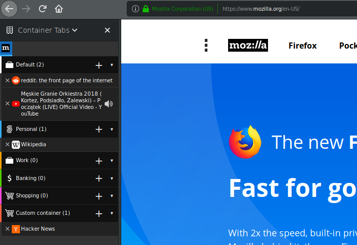
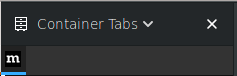
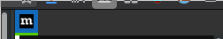

# Container Tabs Sidebar

A firefox addon that shows currently opened tabs in a sidebar grouped by a container.



## How to use

In order to use this addon it's recommended to have firefox version >=59 installed. It might work with versions >=54, but there were no tests done with that version. You can download the latest firefox from [firefox.com](https://www.mozilla.org/en-US/firefox/new/)

### Installing from [addons.mozilla.org](https://addons.mozilla.org/)

1. Visit [Container Tabs Sidebar on mozilla.org](https://addons.mozilla.org/en-US/firefox/addon/container-tabs-sidebar/?src=github)
2. Click Add to Firefox button

### Manually installing the addon for development purposes

#### Debugging via npm:
1. If you have npm installed, you can execute the following command: `npm run dev` a new firefox window should open.

#### Installing as temporary add-on
1. Clone or download a zip of this repository
3. Otherwise open `about:debugging`
4. Click _Load Temporary Add-on_
5. Select manifest.json inside `src` directory
5. The addon should load

### Opening the sidebar

In order to open the sidebar click __F2__ button on your keyboard. If it doesn't work then open any sidebar (eg. using __Ctrl+b__), and change the sidebar via dropdown menu.

Action button for opening the sidebar should be implemented in future releases.

## Appearance modifications

Quote from [Customize with userChrome.css on developer.mozilla.org](https://developer.mozilla.org/en-US/docs/Mozilla/Tech/XUL/Tutorial/Modifying_the_Default_Skin#Customize_with_userChrome.css)
>If you place a file called 'userChrome.css' in a directory called 'chrome' inside your user profile directory, you can override settings without changing the archives themselves. This directory should be created when you create a profile and some examples placed there. The file 'userContent.css' customizes Web pages, whereas 'userChrome.css' customizes chrome files.

**Warning:** Starting with Firefox 69 you have to enable *toolkit.legacyUserProfileCustomizations.stylesheets* in *about:config* in order to use modifications listed below.

### Hiding sidebar header

In order to hide sidebar header you need to append the `userChrome.css` with the following code:

```css
@namespace url("http://www.mozilla.org/keymaster/gatekeeper/there.is.only.xul");

#sidebar-box[sidebarcommand^="containertabs"] #sidebar-header {
	display: none;
}
```

Обратите внимание, файл модет содержать только одну namespace.

|До|После|
|----|---|
| | 

### Hiding tab bar

In order to hide tab bar you need to append the `userChrome.css` with the following code:

```css
@namespace url("http://www.mozilla.org/keymaster/gatekeeper/there.is.only.xul");

#main-window:not([tabsintitlebar="true"]) #TabsToolbar {
    visibility: collapse !important;
}
```

Обратите внимание, файл модет содержать только одну namespace.